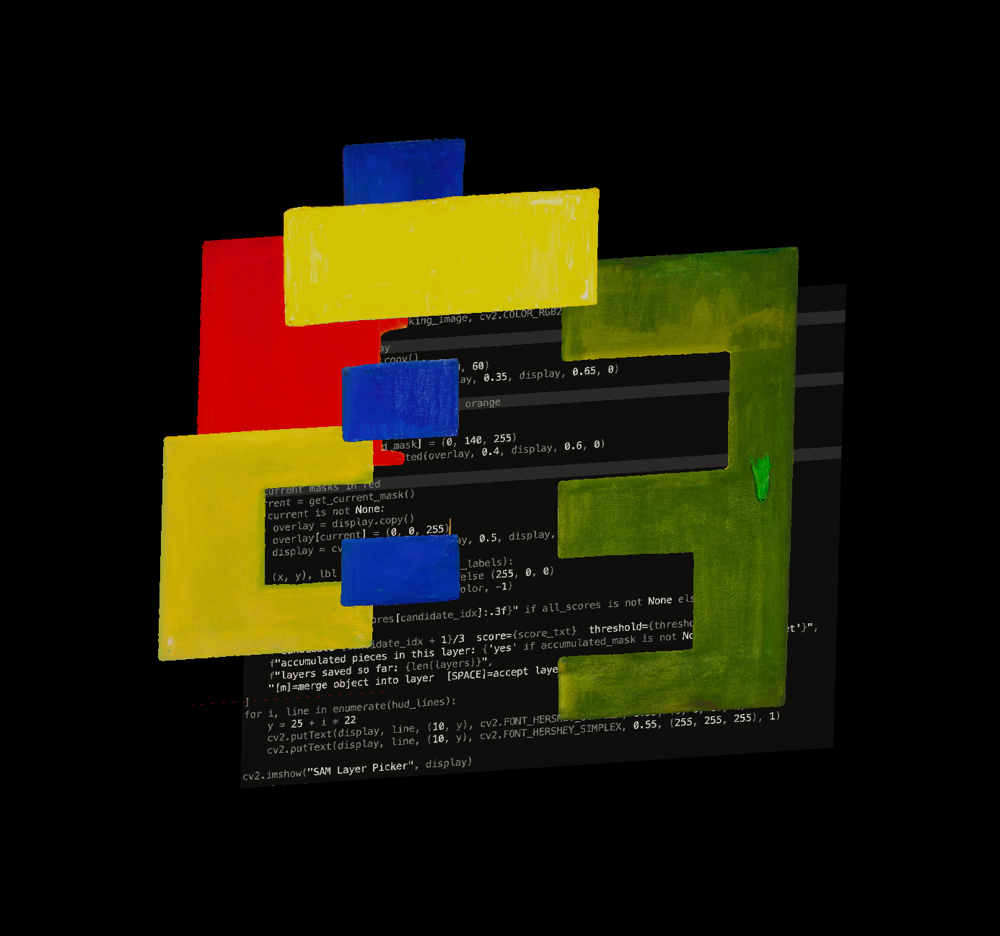

components: 
- separate the image into components
- put each of those components into Blendr objects
- output that 3D visualization onto website-viewable format

starting with womanleadinghorse.png: https://risdmuseum.org/art-design/collection/woman-leading-horse-5603924?return=%2Fart-design%2Fcollection%3Ffield_on_view%3D1%26page%3D7